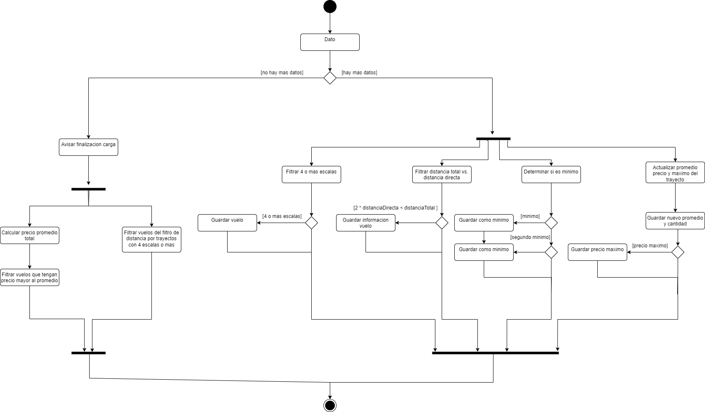

# TP1: FLight Optimizer (Sistemas Distribuidos, FIUBA, 2do Cuatrimestre 2023)

- [enunciado](docs/Enunciado.pdf)
- [Draw.io diagramas](https://app.diagrams.net/#G13VKjgcZEqJwXDUkWIrwqLVkPhrMyS7iD#%7B%22pageId%22%3A%228LiTAJ71kR8NW8oMs1Q8%22%7D)

### Dependencia entre operaciones

### Sistema

### Actividades

