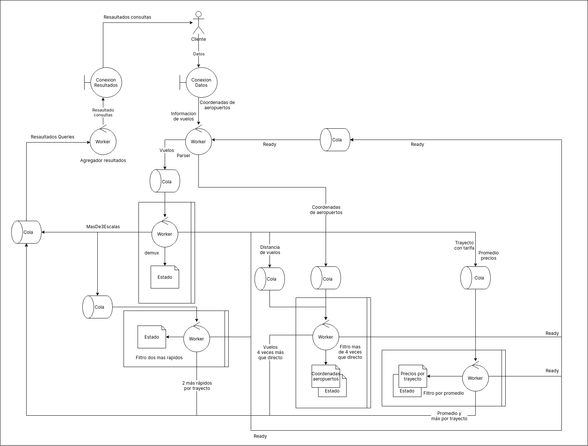
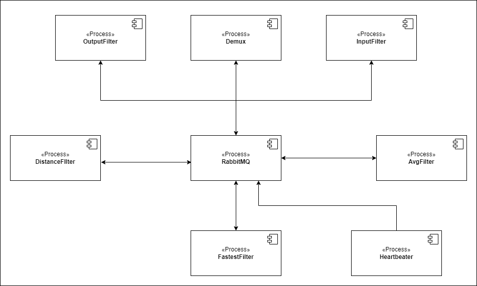

# TP1: FLight Optimizer (Sistemas Distribuidos, FIUBA, 2do Cuatrimestre 2023)

- [enunciado](docs/Enunciado.pdf)
- [Diagramas C4](docs/informes/c4.md)
- [Instrucciones de uso](docs/informes/instrucciones.md)

### Dependencias (DAG)

Este diagrama describe las dependencias que hay entre distintas etapas del
procesamiento, el espesor de las flechas indica el flujo de los datos a travez
de las mismas (excepto por los datos de coordenadas que no tienen correlación
con los datos de vuelos), y las tuplas indican que información proveen.

- La flecha más tenue es la que solo pasa un valor, que es la media general de
  precios.
- Luego están los resultados cuyo flujo solo depende de la cantidad de
  trayectos:
    + Calcular el promedio y el máximo por trayecto, y
    + Los resultados de los 2 vuelos más rápidos por trayecto.
- A estos les siguen los vuelos filtrados por cantidad de escalas y por
  distancia.
- Y las cuatro mas espesas son los datos de los vuelos sin filtrar.

### Sistema

### Despliegue

### Diagrama de paquetes

