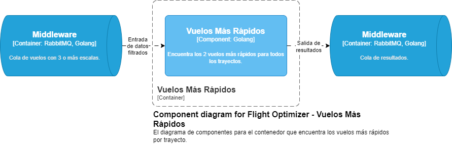
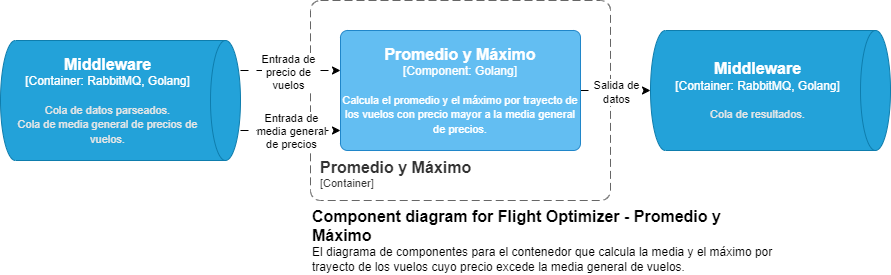

## Diagramas C4

### Contexto

### Contenedores

### Componentes

#### Interfaz

- [Diagrama de código para la interfaz](interfaz.md)

#### Filtro por distancias

- [Diagrama de código para el filtro distancias](distanceFilter.md)

#### Filtro por Duración de Vuelo

- [Diagrama de código para el filtro por duración](avgFilter.md)

#### Filtro por Media General de Precios

- [Diagrama de código para el filtro por promedio](avgFilter.md)
