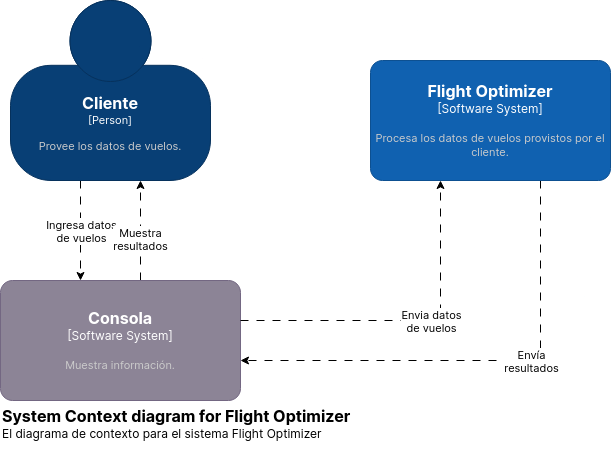

## Diagramas C4

### Contexto

El cliente utiliza la consola (IO) para enviar los datos de las coordenadas de
los aeropuertos y los vuelos, y recibir los resultados de las queries del
sistema. 

### Contenedores

#### Cliente

El cliente recibe resultados desde la consola, que muestra los muestra mediante
*stdout* y ademas los guarda en 4 archivos *.csv* correspondientes a cada una
de las queries:

1. first.csv
2. second.csv
3. third.csv
4. fourth.csvs

#### Flight optimizer

El sistema se despliega en cuatro contenedores:

1. Interfaz $\longrightarrow$ Se encarga de parsear los datos enviados por el
   cliente, distribuirlo a los diferentes workers, recibir los resultados
   obtenidos y enviarlos a la consola (en este caso por red).

2. Vuelos mas rapidos $\longrightarrow$ Se encarga de filtrar los dos vuelos
   mas rapidos para cada trayecto entre todos aquellos vuelos que tengan 3 o
   mas escalas.

3. Filtro distancia $\longrightarrow$ Se encarga de filtrar aquellos vuelos
   cuya distancia total sea mayor a 4 veces la distancia directa entre los
   aeropuertos.

4. Promedio y maximo $\longrightarrow$ Se encarga de agregar, para cada
   trayecto, los precios de todos los vuelos y posteriormente filtrar aquellos
   precios que sean menores que el promedio general de precios y calcular, para
   cada trayecto el promedio y maximo segun lo filtrado.

### Componentes

#### Interfaz

Para realizar su tarea, los datos que recibe y parsea el _input boundary_, los
distribuye a travez de diferentes exchanges de *Rabbitmq*. Envía las
coordenadas al exchange de coordenadas para que las replique en todos los
filtros por distancia y envía los datos de vuelos a los _demuxers_ para que los
procesen y envíen a los demás workers.

Por su parte el _output boundary_ toma los resultados de una cola y los envía
al cliente en formato CSV.

- [Diagrama de código para la interfaz](interfaz.md)

#### Demux

Cada _demuxer_ procesa una porción de los datos, y los envía a los demás
_workers_, o a la cola de resultados. Cuando no hay más datos que procesar
envía la suma y cantidad de tarifas a los filtros por promedio.

- [Diagrama de código para la interfaz](demuxFilter.md)

#### Filtro por distancias

El filtro por distancia consta de dos componentes. Que se ejecutan en el mismo
proceso. En un principio los datos que llegan a la cola de coordenadas se
guardan para su posterior utilizacion (son necesarios para calcular las
distancias directas entre aeropuertos).  
Posteriormente, los datos de vuelos son filtrados segun la relacion entre la
distancia total recorrida en el vuelo y la distancia directa entre aeropuertos.  
Aquellos vuelos que cumplan con la condicion de tener una distancia total
recorrida mayor a 3 veces la distancia directa entre aeropuertos son enviados a
travez de la cola de resultados.

- [Diagrama de código para el filtro distancias](distanceFilter.md)

#### Filtro por Duración de Vuelo

El filtro de vuelos mas rapidos toma datos de una cola en donde existen
unicamente vuelos que tengan 3 o mas escalas.  
Utilizando estos vuelos, para cada trayecto, calcula los dos vuelos de menor
duracion.  
Finalmente, envia los resultados obtenidos por la cola de resultados.

- [Diagrama de código para el filtro por duración](avgFilter.md)

#### Filtro por Media General de Precios

El filtro por promedio toma los vuelos desde la cola correspondiente y agrupa
los precios de los vuelos segun el trayecto de los mismos.  
Una vez calculado el promedio general de precios, el filtro lo recibe, filtra
aquellos vuelos de cada trayecto que tengan un precio menor a este y con los
precios restantes, calcula el maximo y el promedio de precios de cada trayecto.  
Los resultados los envia a la cola de resultados.

- [Diagrama de código para el filtro por promedio](avgFilter.md)

#### Heartbeater

El proceso de heartbeater se encarga, por un lado, de asegurarse que todos los workers se encuentren *vivos* y por otro de reiniciar a aquellos workers que se encuentren *muertos*. 
Para llevar a cabo esta tarea, el heartbeater envia *Heartbeats* a los diferentes workers, recibiendo un *Ok* de parte de aquellos workers que se encuentren *vivos*.
Al mismo, como coexisten multiples heartbeaters en el sistema, los mismos deben decidir cual de ellos es el *leader*. El lider cumple el rol antes descripto y los *members* se aseguran de que el lider continue vivo. 
En caso de que los *members* consideren que el *leader* no se encuentra disponible, se eligira un nuevo lider.

- [Diagrama de código para el hertbeater](heartbeater.md)
