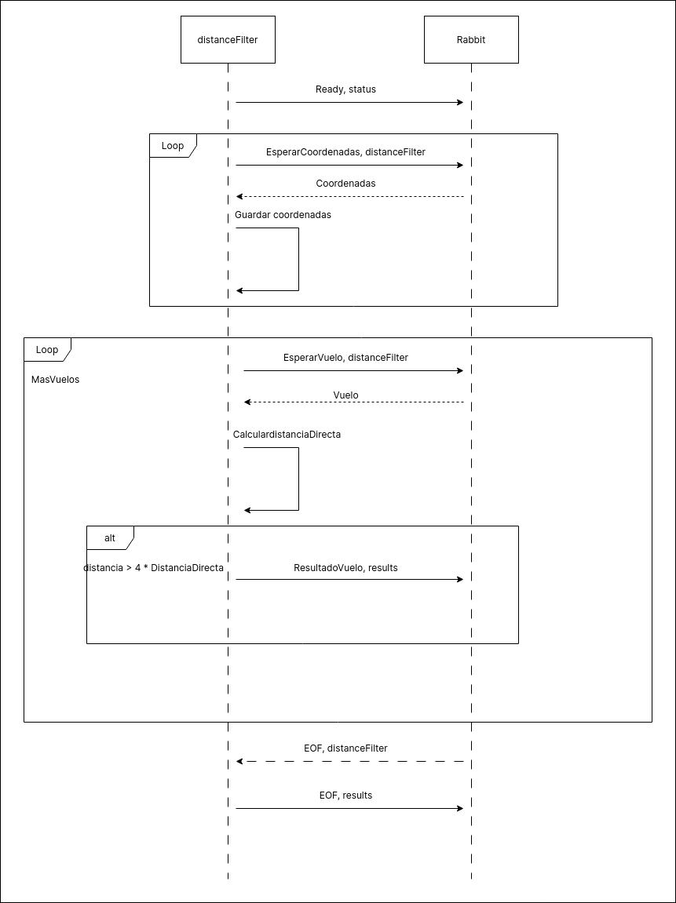

## Filtro Distancias

El diagrama de actividades muestra la logica general implementada para el filtro de distancias (*cmd/distanceFilter*) mientras que el diagrama de secuencia muestra la comunicacion que realiza el mismo.

### Diagrama de actividades

El filtro de distancia comienza haciendo setups tanto de middleware como del propio worker. Luego instancia una goroutine en la cual se ejecuta el filtro en si, la goroutine principal se encarga de esperar por *SIGINT/SIGTERM* y a que termine de ejecutarse el filtro.
El filtro espera por datos, en base a si los mismos corresponden a coordenadas o datos de vuelos realiza una operacion u otra.
Si se procesa un vuelo y el mismo corresponde a un vuelo que cumple la condicion del filtro, el vuelo es enviado a la cola de resultados (yieldFlight).
Finalmente, el filtro anuncia que termino su trabajo y la main goroutine se encarga de liberar los recursos.

### Diagrama de secuencia

El filtro se encarga, en primer lugar de avisar que se encuentra listo para recibir datos.
Posteriormente se encarga de procesar coordenadas hasta que comienzan a llegar datos de vuelos. En este punto el filtro procesa vuelos hasta que se termina el stream de vuelos del cliente. En este punto el filtro anuncia que termino su trabajo.

