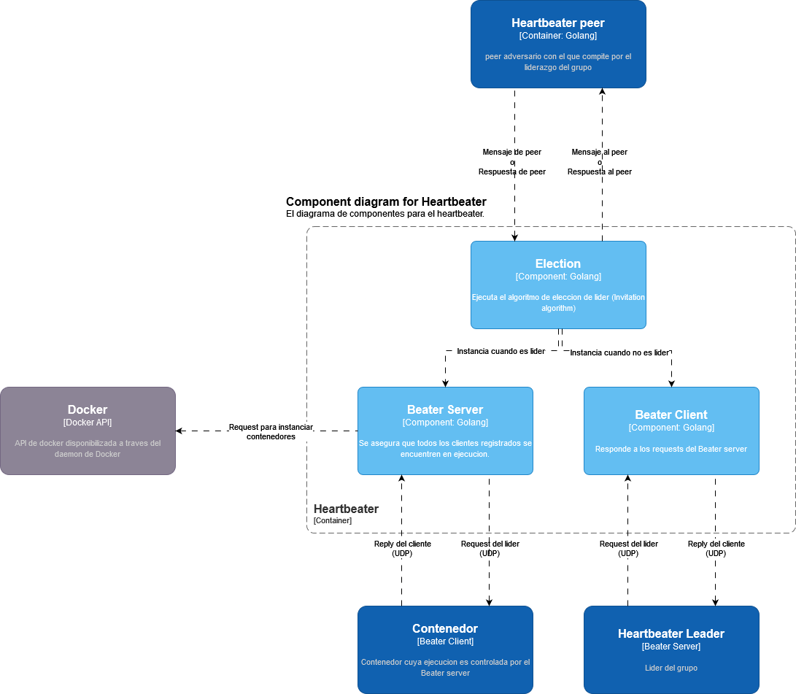

## Heartbeater

### Diagrama C4 de capa 3

El proceso de heartbeater se encarga, por un lado, de asegurarse que todos los workers se encuentren *vivos* y por otro de reiniciar a aquellos workers que se encuentren *muertos*. 
Para llevar a cabo esta tarea, el heartbeater envia *Heartbeats* a los diferentes workers, recibiendo un *Ok* de parte de aquellos workers que se encuentren *vivos*.
Al mismo, como coexisten multiples heartbeaters en el sistema, los mismos deben decidir cual de ellos es el *leader*. El lider cumple el rol antes descripto y los *members* se aseguran de que el lider continue vivo. 
En caso de que los *members* consideren que el *leader* no se encuentra disponible, se eligira un nuevo lider.
Los request que el heartbeater realiza para reinstanciar a otros contenedores, los realiza a traves de la API de docker.

- [Diagrama de código para el hertbeater](heartbeater.md)

### Diagrama de actividades

El diagrama muestra de forma general el funcionamiento logico del heartbeater, tanto como ejecuta la eleccion de lider[^1] como su comportamiento segun sea o bien un lider o bien un cliente.

- En caso de comportarse como cliente, el heartbeater se encarga de controlar el estado del lider y responder a sus controles.
- En caso de comportase como lider, el heartbeater se encarga de responder los controles de los peers y controlar el estado de todos los contenedores del sistema, reinstanciandolos de ser necesario.

[^1]: La eleccion de lider se realiza utilizando el algoritmo de *invitation*, se puede encontrar una explicacion y pseudocodigo del mismo en [el siguiente informe](leaderElection.md)