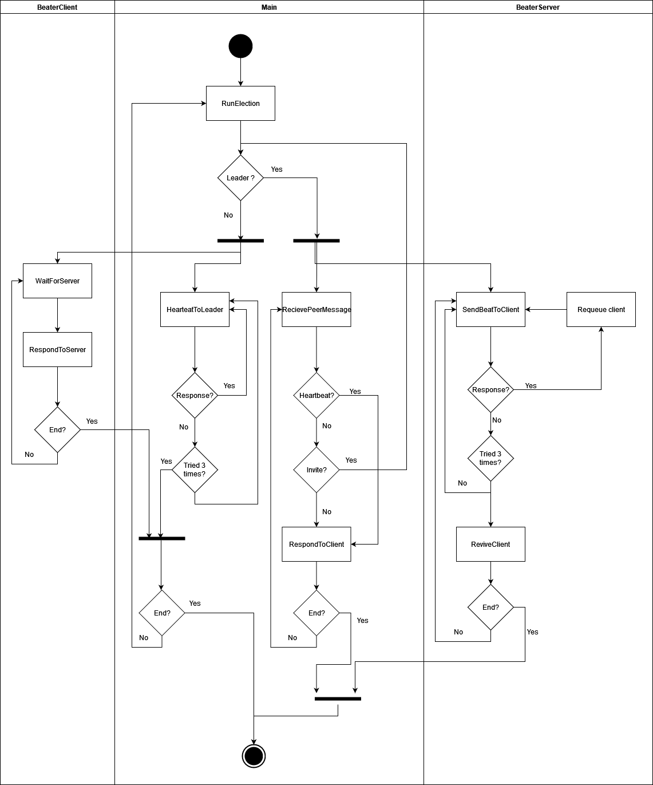

## Heartbeater

### Diagrama de actividades

El diagrama muestra de forma general el funcionamiento logico del heartbeater, tanto como ejecuta la eleccion de lider[^1] como su comportamiento segun sea o bien un lider o bien un cliente.

[^1]: La eleccion de lider se realiza utilizando el algoritmo de *invitation*, se puede encontrar una explicacion y pseudocodigo del mismo en [el siguiente informe](leaderElection.md)