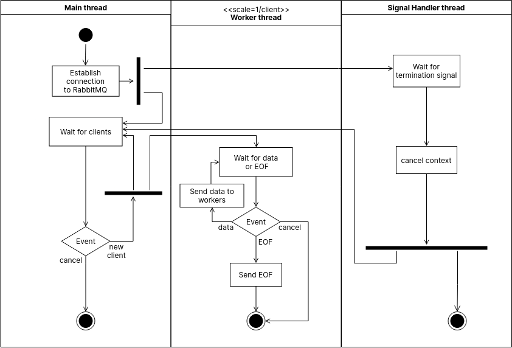
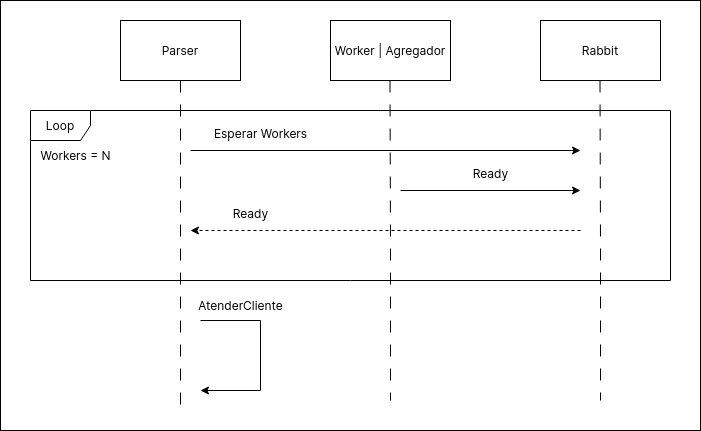

## Parser

Un parser que se encarga de tomar los datos enviados por el cliente y
enviarselos a los filtros por distancia si son coordenadas, o a los demux si
son datos de vuelos.

### Diagrama de actividades

Describe el funcionamiento del parser y el mecansimo de _graceful shutdown_.

El parser comienza haciendo setup del middleware, esperando a que todos los
_workers_ esten listos para así empezar a enviar datos, y empieza a escuchar
por conexiones de clientes.

Luego para cada cliente, inicia o reinicia la conexión con el mismo. Si es un
cliente nuevo, este le envia los dos archivos (coordenadas y vuelos), y si se
está reanudando la conexión, el parser le indica en donde se había quedado para
que el cliente continue enviandole datos desde ahí (utilizando seek(2)). Al
terminar le indica al cliente que procesó todos los datos.

1. Si los datos son coordenadas los envia directamente al filtro por distancias.
2. Si son datos de vuelos, los envia siempre al demux.
3. Una vez finalizado el envio de datos, el parser notifica al cliente.

### Diagramas de secuencia

Los diagramas de secuencia muestran la comunicacion de la interfaz en diferentes momentos de la ejecucion del sistema.

#### Alta de workers

El diagrama muestra la comunicacion entre los diferentes filtros y el parser,
mientras esta espere a que todos los workers le comuniquen que se encuentran
listos para comenzar a procesar datos (*workerUp*/*Ready*).  
Luego, el parser puede comenzar a atender clientes.

#### Conexion y envio de datos del cliente

El diagrama muestra la comunicacion entre el cliente, el parser y RabbitMQ a
medida que se envian los datos, tanto de coordenadas como de vuelos (el envio
de coordenadas ocurre previo al envio de vuelos).  
Ademas, se muestran los datos que se envian a cada exchange.
