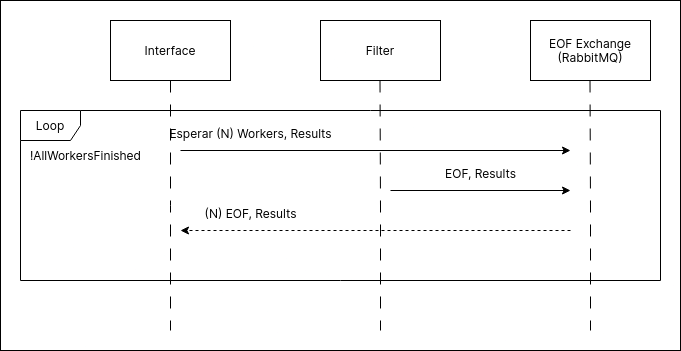

## Interfaz

La interfaz esta compuesta de dos partes:

1. Un parser que se encarga de tomar los datos enviados por el cliente y enviarselos a los filtros que corresponda. Esto incluye filtrar los vuelos por cantidad de escalas.

2. Un agregador que se encarga de recibir los resultados obtenidos por cada filtro y reenviarselos al cliente. Ademas de estar pendiente del momento en que termina el procesamiento de los datos.

Existen dos conexiones con el cliente. Una para los datos enviados por el mismo y otra para los resultados de las queries.

### Diagrama de actividades

El diagrama de actividades muestra la logica general de la interfaz

### Diagrama de secuencia

Los diagramas de secuencia muestran la comunicacion de la interfaz en diferentes momentos de la ejecucion del sistema.

#### Alta de workers

#### Conexion y envio de datos del cliente

#### Secuencia envio de resultados

#### Secuencia fin de datos

