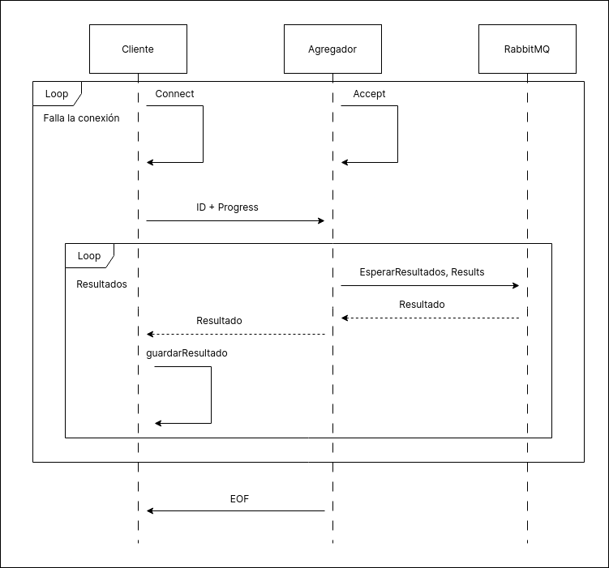

## Interfaz

La interfaz esta compuesta de dos partes:

1. Un parser que se encarga de tomar los datos enviados por el cliente y enviarselos a los filtros que corresponda. Esto incluye filtrar los vuelos por cantidad de escalas.

2. Un agregador que se encarga de recibir los resultados obtenidos por cada filtro y reenviarselos al cliente. Ademas de estar pendiente del momento en que termina el procesamiento de los datos.

Existen dos conexiones con el cliente. Una para los datos enviados por el mismo y otra para los resultados de las queries.

### Diagrama de actividades

El diagrama de actividades muestra la logica general de la interfaz

La interfaz comienza haciendo setup de los componentes necesarios:

1. Middleware
2. Agregador
3. Parser

Luego ejecuta una gorutina para el parser y otra para el agregador.
El agregador espera por resultados directamente y lo hace hasta que hayan llegado todos los resultados y todos los workers hayan terminado (esto se realiza mediante avisos de cada uno de los workers de que su ejecucion termino y la logica es propia del middleware).
El parser primero lanza una gorutina para esperar a que todos los workers esten listos para comenzar a recibir datos (la logica es la misma que la utilizada para determinar que todos los workers finalizaron su trabajo).
Mientras el parser espera por los workers, se prepara para aceptar a un cliente y cuando todos los workers se encuentran activos, el parser comienza a procesar los datos. 
En base a su naturaleza, los envia a cada worker:

1. Si los datos son coordenadas solamente los envia al filtro de distancia
2. Si no, los datos se envian siempre al filtro por promedio y al filtro por distancia.
3. El parser se encarga de calcular el promedio y filtrar por escalas.
    - En caso de que el vuelo tenga tres o mas escalas, lo envia al filtro de los mas rapidos.

4. Una vez finalizado el envio de los datos, el parser envia el promedio al filtro por promedio y finaliza su ejecucion.

### Diagrama de secuencia

Los diagramas de secuencia muestran la comunicacion de la interfaz en diferentes momentos de la ejecucion del sistema.

#### Alta de workers

El diagrama muestra la comunicacion entre los diferentes filtros y la interface, mientras esta espere a que todos los workers le comuniquen que se encuentran listos para comenzar a procesar datos (*workerUp*/*Ready*)
Luego, la interface puede comenzar a atender al cliente.

#### Conexion y envio de datos del cliente

El diagrama muestra la comunicacion entre el cliente, la interface y rabbitMq a medida que se envian los datos, tanto de coordenadas como de vuelos (el envio de coordenadas ocurre previo al envio de vuelos).
Ademas, se muestran los datos que se envian a cada exchange.
Cuando el cliente finaliza el envio de sus datos, el parser envia el promedio al filtro por promedios y un mensaje de control a cada uno de los otros exchanges.

#### Secuencia envio de resultados

El diagrama muestra la comunicacion entre el cliente, el agregador y rabbit para el envio de los resultados.
Se muestra como, siempre que existan mas resultados por enviar, los mismos son tomados desde una cola de rabbit (Results) y enviados al cliente.

#### Secuencia fin de datos

El diagrama muestra la forma en la que todos los workers comunican que terminaron su trabajo. Mostrando como, cuando se cumple la condicion de que cada uno de los workers anuncian que terminaron su trabajo. El agregador le comunica al cliente que se termino el procesamiento de sus datos.