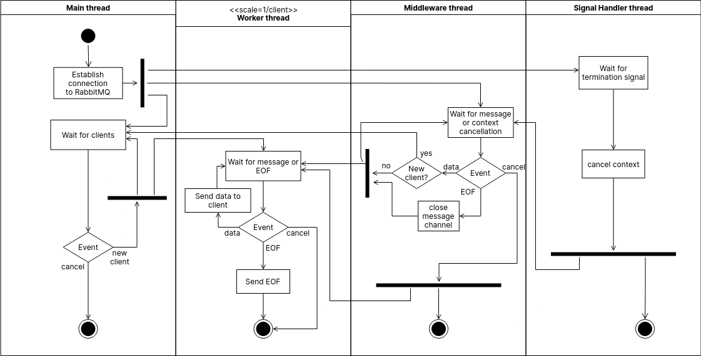

## Agregador de Resultados

El agregador se encarga de recibir los resultados obtenidos por cada filtro y
enviarselos al cliente. Ademas de estar pendiente del momento en que termina el
procesamiento de los datos.

### Diagrama de actividades

Describe el funcionamiento del filtro, su interacción con el middleware y el
mecansimo de _graceful shutdown_.

El agregador espera por resultados directamente y lo hace hasta que hayan
llegado todos los resultados y todos los workers hayan terminado (esto se
realiza mediante avisos de cada uno de los workers de que su ejecucion termino
y la lógica es propia del middleware).

### Diagramas de secuencia

Los diagramas de secuencia muestran la comunicacion del agregador en diferentes
momentos de la ejecucion del sistema.

#### Conexion y envio de datos del cliente

El diagrama muestra la comunicacion entre el cliente, la interface y RabbitMQ a medida que se envian los datos, tanto de coordenadas como de vuelos (el envio de coordenadas ocurre previo al envio de vuelos).
Ademas, se muestran los datos que se envian a cada exchange.
Cuando el cliente finaliza el envio de sus datos, el parser envia el promedio al filtro por promedios y un mensaje de control a cada uno de los otros exchanges.

#### Secuencia envio de resultados

El diagrama muestra la comunicacion entre el cliente, el agregador y RabbitMQ
para el envio de los resultados.  
Se muestra como siempre que existan mas resultados por enviar, los mismos son
tomados de una cola de RabbitMQ (`results`) y enviados al cliente.

#### Secuencia fin de datos

El diagrama muestra la forma en la que todos los workers comunican que
terminaron su trabajo. Mostrando como, cuando se cumple la condicion de que
cada uno de los workers anuncian que terminaron su trabajo. El agregador le
comunica al cliente que se termino el procesamiento de sus datos.
